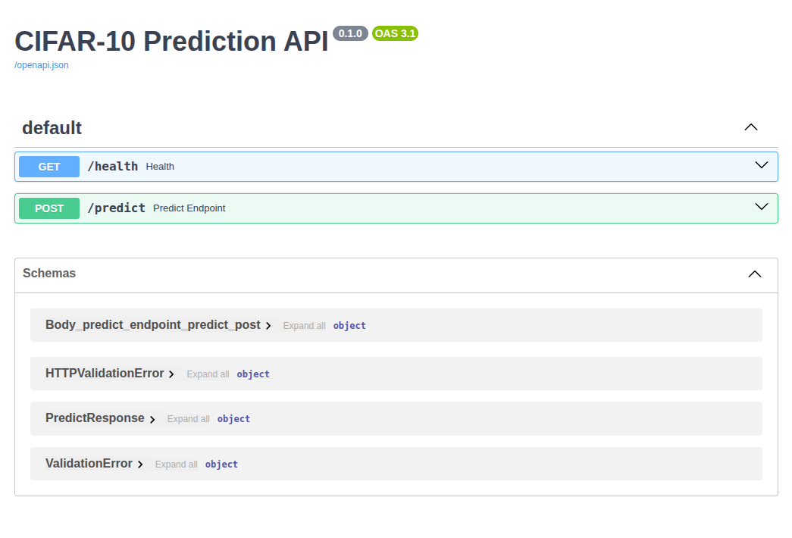
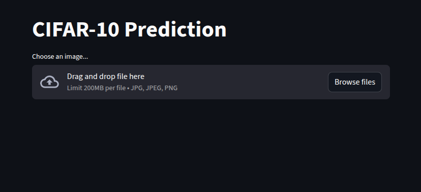
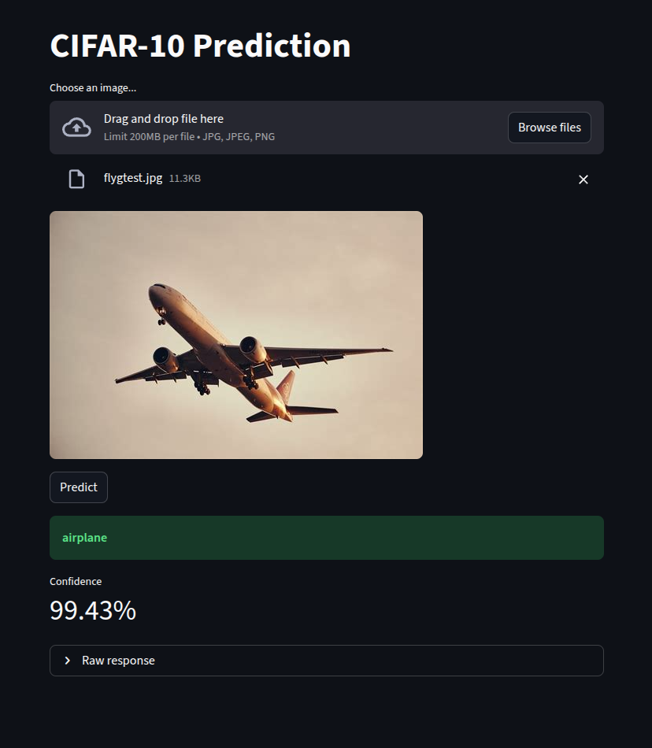

# CIFAR-10 Image Classification Service

<p align="center">
  
  
  
  
  
</p>
This project demonstrates integration and containerized deployment of a trained PyTorch CNN model served via FastAPI, with a separate Streamlit interface and Docker-based service isolation.

## Key Features

- End-to-end model serving with FastAPI
- Docker-based service isolation and networking
- Structured inference pipeline with consistent preprocessing
- Stateless API design
- Collaborative development via PR-based workflow

## Architecture Overview
The system consists of two services:

- A FastAPI inference service
- A Streamlit-based user interface

Both run in separate Docker containers connected through an internal network.

## System Diagram

```text
           ┌────────────────┐
           │  Streamlit UI  │
           └────────┬───────┘
                    │
           ┌────────▼────────┐
           │   FastAPI API   │
           └────────┬────────┘
                    │
           ┌────────▼────────┐
           │  PyTorch Model  │
           └─────────────────┘
```

## Project Structure
```
.
├── app/
│   ├── config.py          # Model configuration
│   ├── main.py            # FastAPI entrypoint
│   ├── make_model.py      # Model architecture definition
│   └── model.py           # Model loading & inference logic
├── artifacts/
│   └── best_model.pt      # Trained weights
├── streamlit_app.py       # UI service
├── Dockerfile
├── docker-compose.yml
├── pyproject.toml
└── uv.lock
```

## Model Details
- Architecture defined in `app/make_model.py`
- Weights stored in `artifacts/best_model.pt`
- Lazy-loaded via `_get_model()`
- Preprocessing:
    - `Resize(32, 32)`
    - `ToTensor()`
    - `Normalize(mean=(0.4914, 0.4822, 0.4465), std=(0.2470, 0.2435, 0.2616))`
- Softmax used to compute confidence

## API Endpoints

<p align="center">

</p>

### `GET /health`
Health check endpoint.

Expected response:
```json
{"status":"ok"}
```

### `POST /predict`
Accepts an image file (multipart upload) and returns:
```json
{
    "predicted_index": 3,
    "predicted_label": "cat",
    "confidence": 0.87
}
```

## Streamlit Frontend
<p align="center">

</p>

A simple Streamlit UI is included for manual testing.

- Upload an image (`.jpg`, `.jpeg`, `.png`)
- Preview the image
- Click **Predict** to call `POST /predict`
- Displays predicted label and confidence
- Raw JSON response available via expander

The frontend sends a multipart request to the FastAPI API at:
`http://localhost:8000/predict`


## Running the System
### Build and start all services
```bash
docker compose up --build
```

### Access the Services
**API:**
http://localhost:8000

**Streamlit UI:**
http://localhost:8501

## Verification
### Health Check
`curl http://localhost:8000/health`

### Prediction

<p align="center">

</p>

Manual test:
```bash
curl -X POST \
    -F "file=@example.jpg" \
    http://localhost:8000/predict
```

## Deployment Characteristics

- Containerized multi-service setup
- Stateless inference API
- CPU-compatible runtime

## Development Process

Feature-branch workflow with mandatory pull request reviews and a protected `main` branch.

Key pull requests:

- [Model integration](https://github.com/pytt156/mlops-model-serving/pull/6)
- [Containerization](https://github.com/pytt156/mlops-model-serving/pull/3)
- [Frontend integration](https://github.com/pytt156/mlops-model-serving/pull/8)


## Reflection and Notes

- **Pull Requests & Merge Conflicts**  
  Working with feature branches required keeping the branch updated with `main` to avoid conflicts. Regular rebasing and PR reviews helped maintain a clean integration workflow.

- **Future Improvements**  
  The model reused from a previous assignment is not heavily optimized. Further improvements could include performance tuning, architectural experimentation, better configuration handling (e.g., environment variables), structured logging, CI for container builds, and more robust input validation.

- **Use of LLMs**  
  LLM were used as a development assistant for reviewing structure, clarifying architectural decisions, debugging environment issues, and refining documentation. All implementation and verification were performed manually.